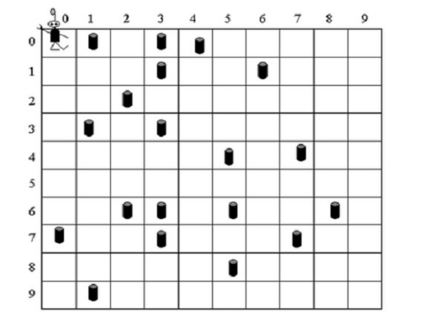
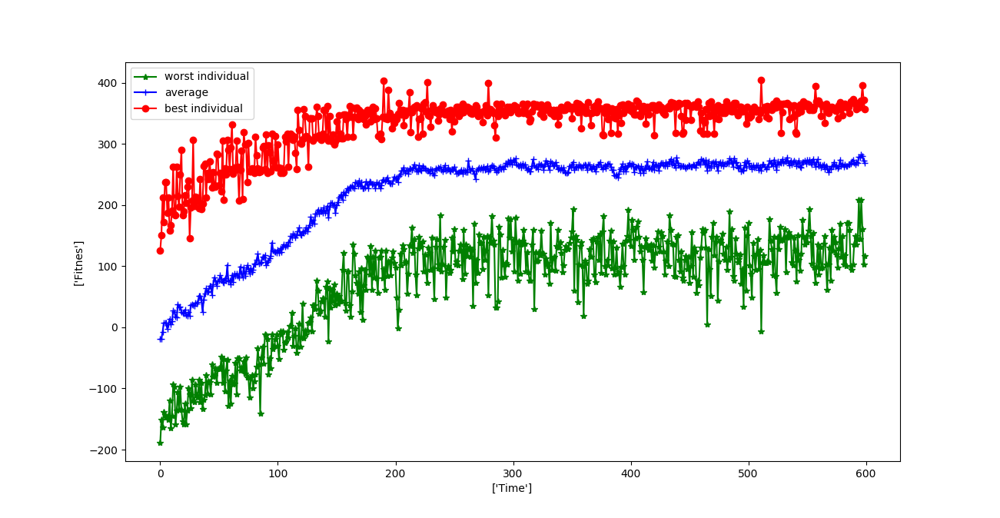

# Example of the application of a genetic algorithm

This is an implementation of the example "Robby" found in the book:

Complexity a guided tour by Melanie Mitchell. 
The script is an implementation of fa Genetic Algorithm to solve the problem as proposed in the book 

[1] 

The problem consists of an imaginary robot called Robby, who has to navigate across a board in which there are some cans. 
The objective is to find the best route in which the robot can pick all the cans. For this purpose a Genetic Algorithm is implemented as follows:

```
1. An initial population of candidate solutionsis genetared randomly. 
2. The fitness of eac individual in the current population is calculated
3. Some number of indivuduals with the highest scores are selected to be the parents of the next generation
4. Crossover is performed with pairs of the selected individuals until a new population with the same amounf of individuals as the original is created
5. Go to sstep 2.
```

The robot always start in the position (0,0) in a bidimensional board and has 5 possible moves:

1. Move up
2. Move down
3. Move left
4. Move right
5. Pick up

The fit function is calculated as follows:
* If the robot tries to go out of the limits of the board, it is punished with -1 points.
* If the robot tries to pick up a can where there is no can it is penalized with -5 points. 
* If the robot picks up a can where there is actually a can it obtains +50 points. 

To see the results just run the `Example_Robby.py`  file. By default it is set with a population of 100 individuals, with 200 individuals each one and a mutation rate of 0.4 and it repeats over 600 iterations. To change this parameters just change the values of `population`, `num_instruct`, `generations` and `mutation_rate` respectively. The simulation it is also set by default in a board of size 10x10 with 10 cans to pick up, you can also change this values in the script being `siz` and `amount_of_cans` respectively. 



Image from [1] (p. 131) 

The script will perform the genetic algorithm over the number of generations indicated and it will show a plot with the score of the best and the worst individual, and the average of each generation. 

By the end it will also run a graphical representation of the robot (blue dot) movingin the board and picking up the cans (red dots). 


